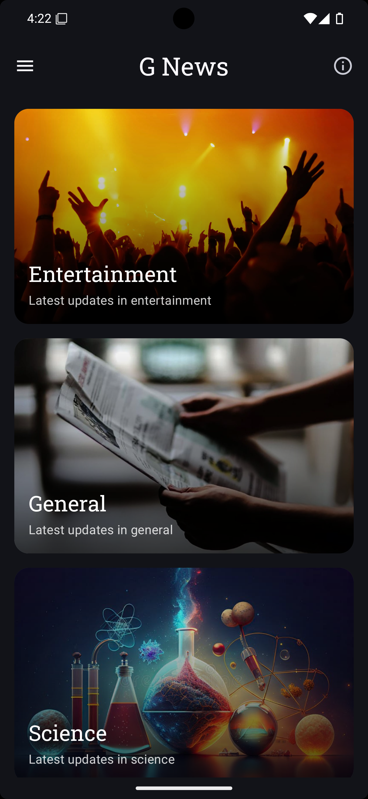
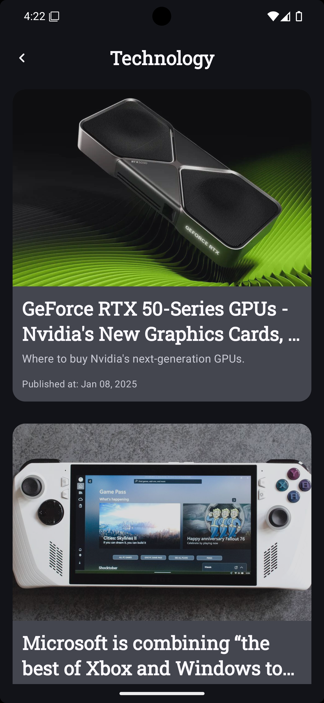

# 🌟 GabiNews App 🌟

GabiNews is a sleek and modern news application that keeps you updated with the latest news across various categories like 🌐 Technology, 💊 Health, 🧪 Science, ⚽ Sports, and more.

---

## ✨ Features

- 🎨 **Beautiful UI**: Designed with Jetpack Compose and Material3 for a delightful user experience.
- 🏛️ **MVVM Architecture**: Built using MVVM with **Koin** for dependency injection.
- 🌐 **Real-Time News**: Fetches top headlines from the [News API](https://newsapi.org/).
- 📂 **Categorized News**: Explore topics by category for a personalized experience.
- 📶 **Offline Support**: Shows a custom offline message when you're not connected.

---

## 🖼️ Screenshots

<div style="display: flex; justify-content: space-between; gap: 10px;">
  
  
  
</div>

---

## 🏗️ Project Structure

```
📂 GabiNews
├── 📂 di          # Dependency Injection using Koin
├── 📂 model       # Data models and network setup
├── 📂 ui          # Jetpack Compose-based UI screens
├── 📂 util        # Utility classes (formatters, error handlers, etc.)
├── 📂 theme       # Colors, typography, and theme setup
```

---

## 🛠️ Dependencies

- 🧩 **Jetpack Compose**
- 🔗 **Retrofit**: For API communication.
- 🛠️ **Koin**: Dependency injection.
- 📄 **Gson**: JSON serialization/deserialization.
- 🖼️ **Coil**: For image loading.
- 🎨 **Accompanist**: UI enhancements like system UI controller.

---

## 🚀 Getting Started

### Prerequisites
📌 Ensure you have:
- Android Studio Electric Eel (or later) installed.
- Kotlin 1.8 or later.

### Installation

1. **Clone the Repository**:
   ```bash
   git clone https://github.com/ShervinKazemi/g-news.git
   ```
2. **Open in Android Studio**.
3. **Add Your API Key**:  
   Update the `Constants.kt` file with your [News API](https://newsapi.org/) key:
   ```kotlin
   const val API_KEY = "Your_Api_Key"
   ```
4. **Build and Run**: Click ▶️ in Android Studio to see it in action.

---

## 🙌 How to Contribute

We welcome contributions! 🎉  
1. 🍴 Fork the repository.  
2. 🌟 Create a feature branch.  
3. 🛠️ Make your changes.  
4. 🔄 Submit a Pull Request.

---

## 📧 Contact

👨‍💻 **Developer**: **Shervin Kazemian**  
📩 **Email**: [shervink.codes@gmail.com](mailto:shervink.codes@gmail.com)

---

### 🔥 Stay Informed with GabiNews! 📱
